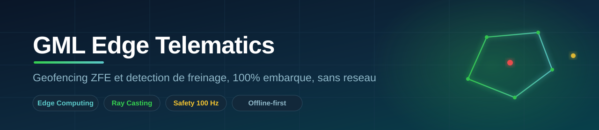
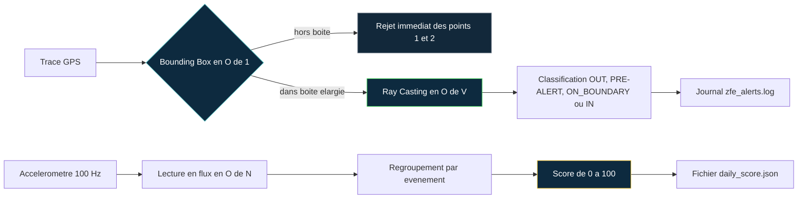

<div align="center">



<br/>

**Preuve de concept d'une télématique embarquée qui décide en local, sans réseau.**
Détection d'entrée en Zone à Faibles Émissions et détection de freinage violent,
exécutées sur tablette durcie à bord du camion, même en zone blanche.

<br/>


-5BC8C8)


<br/>

[Contexte](#-contexte) · [Architecture](#-architecture) · [Démarrage](#-démarrage-rapide) · [Résultats](#-résultats-attendus) · [Choix techniques](#-choix-techniques) · [Limites](#-limites-assumées)

</div>

<br/>

```
░░░░░░░░░░░░░░░░░░░░░░░░░░░░░░░░░░░░░░░░░░░░░░░░░░░░░░░░░░░░░░░░░░░░░░░░░░░░░░░░░░░
```

## 📍 Contexte

Un poids lourd entre dans la ZFE de Lyon via le tunnel de Fourvière. La 4G tombe,
la carte ZFE ne se charge pas, aucune alerte : **375 EUR d'amende**. En parallèle,
l'assureur refuse un bonus faute de preuve comportementale, car le chronotachygraphe
ne mesure ni freinage, ni virage, ni accélération tri-axiale.

Ce POC démontre la réponse : **déplacer la décision critique dans le camion**. Deux
moteurs tournent en local sur matériel contraint (Snapdragon 660, 150 Mo de RAM),
sans dépendre du cloud.

| Moteur | Role | Entree | Sortie |
|---|---|---|---|
| **ZFE (Geo)** | Détecter l'entrée en zone sans réseau | Trace GPS + polygone ZFE | Pré-alerte, entrée, présence |
| **Safety (Physics)** | Détecter le freinage violent | Accéléromètre 3 axes | Événement HIGH/SEVERE, score |

<br/>

```
░░░░░░░░░░░░░░░░░░░░░░░░░░░░░░░░░░░░░░░░░░░░░░░░░░░░░░░░░░░░░░░░░░░░░░░░░░░░░░░░░░░
```

## 🏗 Architecture



Le filtrage à deux étages est le cœur du POC : la **Bounding Box rejette en temps
constant** les positions lointaines (points 1 et 2, sans aucun calcul de distance),
et le **Ray Casting en O(V) ne s'exécute que** pour les positions candidates (points 3,
4 et 5). C'est ce qui rend le calcul tenable sur matériel embarqué.

<br/>

```
░░░░░░░░░░░░░░░░░░░░░░░░░░░░░░░░░░░░░░░░░░░░░░░░░░░░░░░░░░░░░░░░░░░░░░░░░░░░░░░░░░░
```

## 📂 Structure

```
gml-edge-telematics-poc/
├── data/
│   ├── lyon_polygon.json         polygone ZFE non rectangulaire (5 sommets)
│   ├── truck_gps.json            trace GPS (5 points : approche + entree)
│   └── accelerometer_data.csv    10 echantillons (acc_x, acc_y, acc_z)
├── src/
│   └── main.py                   moteurs ZFE + Safety
├── output/                       genere a l'execution
│   ├── zfe_alerts.log
│   └── daily_score.json
├── run_all.py                    point d'entree : main.py PUIS run_tests.py
├── run_tests.py                  tests de non-regression (48 cas)
├── run_all_gui.py                lanceur graphique optionnel (fenetre macOS)
├── requirements.txt
└── README.md
```

<br/>

```
░░░░░░░░░░░░░░░░░░░░░░░░░░░░░░░░░░░░░░░░░░░░░░░░░░░░░░░░░░░░░░░░░░░░░░░░░░░░░░░░░░░
```

## 🚀 Démarrage rapide

**Prérequis :** Python 3.10 ou supérieur. Dépendance unique et optionnelle :
`colorama` (couleurs console). Sans elle, le POC tourne en noir et blanc, sans planter.

<table>
<tr>
<td width="50%" valign="top">

**Windows (PowerShell)**

```powershell
cd gml-edge-telematics-poc
pip install -r requirements.txt

# demo propre (optionnel)
if (Test-Path output) {
  Remove-Item output -Recurse -Force
}

python run_all.py
```

</td>
<td width="50%" valign="top">

**Linux / macOS**

```bash
cd gml-edge-telematics-poc
pip install -r requirements.txt

# demo propre (optionnel)
rm -rf output

python3 run_all.py
```

</td>
</tr>
</table>

`run_all.py` exécute d'abord `src/main.py` (qui génère les sorties), puis
`run_tests.py` (qui vérifie les 48 cas). Les scripts restent lançables séparément :

```bash
python run_all.py        # tout : moteurs + tests (recommande)
python src/main.py       # moteurs seuls (genere output/)
python run_tests.py      # tests seuls (doit afficher 48/48)
```

<br/>

```
░░░░░░░░░░░░░░░░░░░░░░░░░░░░░░░░░░░░░░░░░░░░░░░░░░░░░░░░░░░░░░░░░░░░░░░░░░░░░░░░░░░
```

## 📊 Résultats attendus

Sortie brute du terminal (sans accents, telle que l'affiche la console) :

```
--- Moteur 1 : ZFE (Geo) -----------------------------------------
[ZFE] Bounding Box stricte : lat[45.730,45.790] lon[4.800,4.880] | marge approche 500 m
       point 1 | attendu=OUT | detecte=OUT | rejet O(1)
       point 2 | attendu=OUT | detecte=OUT | rejet O(1)
[PRE-ALERT ZFE] point=3 ts=08:00:20 approche zone (dist bord=451 m)
[ALERT ZFE] ENTREE point=4 ts=08:00:30 lat=45.76 lon=4.8357 (profondeur=2284 m)
[ALERT ZFE] PRESENCE point=5 ts=08:00:40 lat=45.75 lon=4.85 (profondeur=1004 m)
--- Moteur 2 : Safety (Physics) ----------------------------------
[HARSH_BRAKING] ts=1678880005 acc_y=-3.45 m/s2 (seuil -2.5)
   -> evenement freinage : pic=-3.45 m/s2 sur 1 echantillon(s) | severite=HIGH
--- Synthese -----------------------------------------------------
ZFE    : 1 entree(s), 1 pre-alerte(s), 0 bordure(s)
Safety : 1 echantillon(s) sous seuil => 1 evenement(s) | score = 85/100
```

> **Note.** Les points 1 et 2 ne déclenchent aucun calcul de distance : rejetés en
> O(1) hors de la boîte englobante. Seuls les points 3, 4 et 5 déclenchent le ray
> casting. Ce bloc terminal est volontairement sans accents, comme la console.

**Fichiers generes**

| Fichier | Contenu |
|---|---|
| `output/zfe_alerts.log` | pré-alerte point 3 (451 m du bord), entrée point 4 (2284 m), présence point 5 (1004 m) |
| `output/daily_score.json` | 1 échantillon sous seuil (acc_y = -3.45) regroupé en 1 événement HIGH, score 85/100 |

**Tests**

```
[PASS] Bilan : 48/48 tests passes - POC robuste valide pour la demonstration
```

Les 48 tests couvrent les cas nominaux **et** 8 cas de robustesse : fichier absent,
JSON malformé, colonne `acc_y` manquante, valeur non numérique, classification
exacte des 5 sommets et des 5 milieux d'arêtes (`ON_BOUNDARY`), précontrôle des
entrées avant écriture.

<br/>

```
░░░░░░░░░░░░░░░░░░░░░░░░░░░░░░░░░░░░░░░░░░░░░░░░░░░░░░░░░░░░░░░░░░░░░░░░░░░░░░░░░░░
```

## 🎬 Démonstration filmée (optionnel)

Le script `run_all_gui.py` ouvre une fenêtre façon macOS (trois boutons rouge,
jaune, vert) et **exécute le vrai `run_all.py` en direct**, en affichant sa sortie
colorisée ligne par ligne. Aucune valeur n'est recopiée : tout provient de
l'exécution réelle. Les scripts existants ne sont pas modifiés.

```bash
pip install PySide6
python3 run_all_gui.py
```

Si PySide6 est absent, `run_all_gui.py` bascule automatiquement sur l'exécution
terminal de `run_all.py`.

<br/>

```
░░░░░░░░░░░░░░░░░░░░░░░░░░░░░░░░░░░░░░░░░░░░░░░░░░░░░░░░░░░░░░░░░░░░░░░░░░░░░░░░░░░
```

## 🧠 Choix techniques

<details>
<summary><b>Bounding Box + Ray Casting réellement justifiés</b></summary>

<br/>

Le polygone est **non rectangulaire**. Les points 1 et 2 sont hors de la boîte
englobante élargie (marge de pré-alerte de 500 m) et rejetés en O(1) sans calcul de
distance ni ray casting. Le statut `ON_BOUNDARY` est traité par distance métrique
avant le ray casting, afin de stabiliser sommets et arêtes. Le calcul O(V) n'a lieu
que pour les points proches ou internes (3, 4 et 5) : seul le ray casting distingue un
point proche du bord mais hors zone (point 3, pré-alerte à 451 m) d'un point
réellement intérieur (points 4 et 5).

</details>

<details>
<summary><b>Traitement en flux O(N)</b></summary>

<br/>

L'accéléromètre est lu ligne par ligne, en mémoire constante. À 100 Hz sur 3 axes
(plusieurs millions d'échantillons par jour et par camion), un O(N²) serait
intenable sur la cible embarquée.

</details>

<details>
<summary><b>Score par événement, pas par échantillon</b></summary>

<br/>

À 100 Hz, un freinage couvre plusieurs échantillons consécutifs sous le seuil. Les
compter un à un surpénaliserait un seul geste. Les échantillons consécutifs sont
regroupés en un événement, classé par son pic (HIGH si pic > -5 m/s², SEVERE sinon).
Ici, un seul échantillon (acc_y = -3.45) franchit le seuil : un unique événement
HIGH, d'où le score de 85/100.

</details>

<details>
<summary><b>Ambiguïté de seuil (point critique de l'énoncé)</b></summary>

<br/>

Seuil opérationnel retenu : `acc_y < -2.5 m/s²`. Un seuil de `2.5 G` vaudrait
environ 24,5 m/s², une décélération de quasi-collision jamais atteinte en freinage
de service : le détecteur serait muet. La ligne `acc_y = -3.45` est donc bien classée
`HARSH_BRAKING`, ce que les tests confirment.

</details>

<br/>

```
░░░░░░░░░░░░░░░░░░░░░░░░░░░░░░░░░░░░░░░░░░░░░░░░░░░░░░░░░░░░░░░░░░░░░░░░░░░░░░░░░░░
```

## ⚠️ Limites assumées

Polygone et trace GPS **synthétiques** : à remplacer par la donnée ZFE officielle de
la collectivité (mise à jour OTA) avant tout usage réel. La trace GPS est
échantillonnée à faible fréquence pour la lisibilité ; la précision de détection
d'entrée réelle est bornée par la fréquence GPS, pas par les 100 Hz de
l'accéléromètre. Le seuil unique ne distingue pas un freinage d'urgence légitime
d'une conduite agressive : enrichissement V1 (contexte vitesse, durée, récurrence) à
calibrer avec l'assureur. Le POC valide la **faisabilité algorithmique** ; la
compatibilité avec la Zebra ET40 reste à confirmer par un benchmark sur appareil réel.

<br/>

<div align="center">

```
░░░░░░░░░░░░░░░░░░░░░░░░░░░░░░░░░░░░░░░░░░░░░░░░░░░░░░░░░░░░░░░░░░░░░░░░░░░░░░░░░░░
```

**MBA Big Data & IA · Bloc 2 · GreenMove Logistics**

*Preuve de concept académique. Chiffres reproductibles par `python3 run_all.py`.*

</div>
